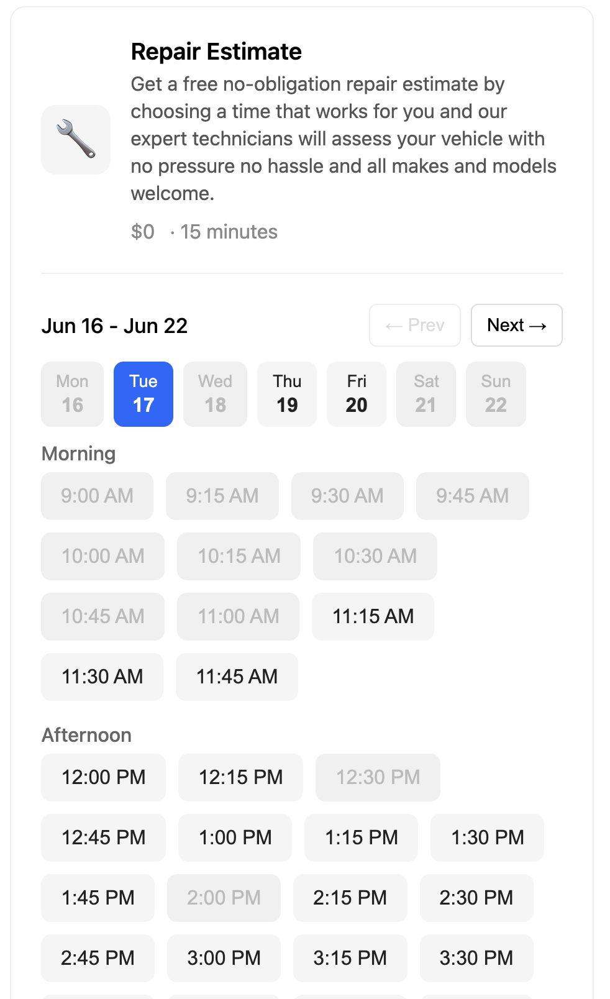
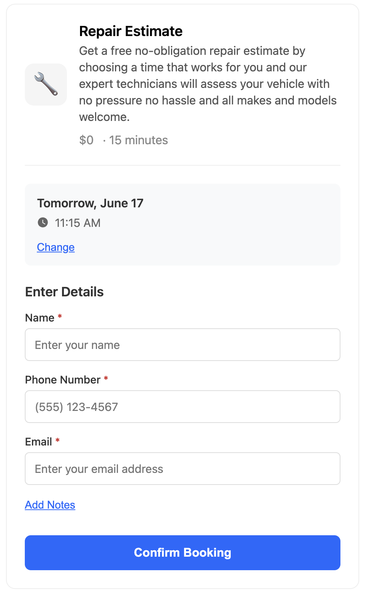
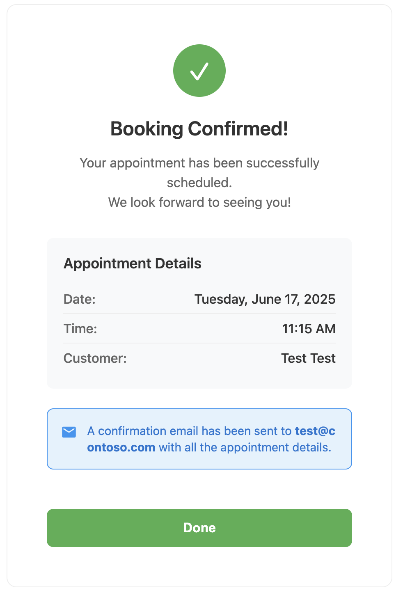

# Microsoft Bookings Widget

[](https://deploy.workers.cloudflare.com/?url=https://github.com/bman46/bookings-workers.git)

This project provides a custom frontend and backend integration for Microsoft 365 Bookings. It enables a modern, user-friendly booking experience while leveraging Microsoft Bookings as the backend. The backend is OpenAPI-compliant, making it easy to integrate with the frontend and other systems. The frontend is built as a widget using LitElement web components, and the backend exposes endpoints for business info, services, staff availability, and appointment creation.

## Get started

1. Sign up for [Cloudflare Workers](https://workers.dev). The free tier is more than enough for most use cases.
2. Create an [Azure EntraID app](#Azure-EntraID-Configuration).
3. Continue to either the [Development](#Development) or [Deployment](#Deployment) instructions.

## Development

1. Clone this project and install dependencies with `npm install`
2. Set the needed env vars in a file named `.dev.vars`
```
TENANT_ID=[Directory (tenant) ID]
CLIENT_ID=[Application (client) ID]
CLIENT_SECRET=[Client secret value]
```
3. Update [index.html](dist/index.html) with information about your booking page.
4. Run `wrangler dev` to start a local instance of the API.
5. Open `http://localhost:8787/docs` in your browser to see the Swagger interface where you can try the endpoints.
6. Changes made in the `src/` folder will automatically trigger the server to reload, you only need to refresh the Swagger interface.

## Deployment

1. Sign up for [Cloudflare Workers](https://workers.dev). The free tier is more than enough for most use cases.
2. Deploy to CloudFlare: [](https://deploy.workers.cloudflare.com/?url=https://github.com/bman46/bookings-workers.git)
3. On the deploy screen, under `Advanced settings > Build variables` add the following variables. Click the encrypt button for `CLIENT_SECRET`:
```
TENANT_ID=[Directory (tenant) ID]
CLIENT_ID=[Application (client) ID]
CLIENT_SECRET=[Client secret value]
ALLOWED_ORIGINS=[Domain/subdomain that can use this widget],[another (optional) domain/subdomain that can use this widget]
```

> [!TIP]
> If you already deployed the app, you can add this using the [Cloudflare Dashboard](https://developers.cloudflare.com/workers/configuration/environment-variables/#add-environment-variables-via-the-dashboard).

4. Embed the widget into your website. Example:
```html
<!DOCTYPE html>
<head>
  <script type="module" src="(your worker domain)/index.js"></script>
</head>
<body>
  <booking-card api-url="(your worker domain)" bookings-id="MyBookingsPage@Contoso.com" service-displayName="My Service" icon="🔧"></booking-card>
</body>
```

## Azure EntraID Configuration

1. Sign in to the [Microsoft Entra admin center](https://entra.microsoft.com/) as at least an [Application Developer](https://learn.microsoft.com/en-us/entra/identity/role-based-access-control/permissions-reference#application-developer).

2. If you have access to multiple tenants, use the Settings icon  in the top menu to switch to the tenant in which you want to register the application.

3. Browse to `Entra ID > App registrations` and select `New registration`.

4. Enter a meaningful name for the app, for example `booking-widget`.

5. Select `Accounts in this organizational directory only (John McShane Auto Body only - Single tenant)` for `Supported account types`

6. Click `Register`

7. On the app `Overview` screen, note the `Application (client) ID` and `Directory (tenant) ID`. These will be used later.

8. Navigate to `Certificates & secrets > Client secrets` and click `new client secret`. Name it accordingly, click `Add`. Note the value for use later. We will refer to this as the `Client secret value` in future steps

9. Navigate to `API Permissions > Add a permission > Microsoft Graph > Application Permissions`. Assign the following GraphAPI permissions:
```
Bookings.Read.All
BookingsAppointment.ReadWrite.All
```

10. Click `Add Permissions` to set the permissions. Then, click `Grant Admin Consent for [COMPANY]` button to grant the app access to these API endpoints.

9. Return to either the [Development](#Development) or [Deployment](#Deployment) instructions.

## Pictures
### Time selection


### Customer Information


### Confirmation Screen
